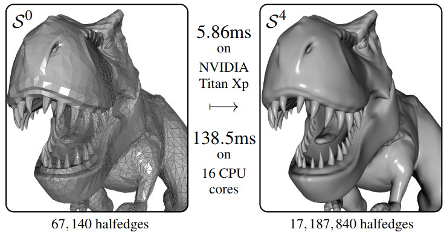

This repository provides a library for fast subdivision of polygonal surfaces.
Currently it supports Catmull-Clark and Loop subdivision, and has both CPU and GPU backends with parallel implementations.
For most use cases, subdivision is real-time.

This library is the implementation of the following two papers:
* [A Halfedge Refinement Rule for Parallel Catmull-Clark Subdivision](http://kenneth.vanhoey.free.fr/index.php?page=research&lang=en#DV21), HPG 2021, by [Jonathan Dupuy](http://onrendering.com) and [Kenneth Vanhoey](http://kvanhoey.eu/)
* A Halfedge Refinement Rule for Parallel Loop Subdivision (under review)

# Organization
The `lib/` folder contains the library files: see [lib/README.md](lib/README.md)

The `root` folder contains several usage examples that do the following:
* `catmull-clark_cpu` Catmull-Clark subdivision using the CPU backend
* `catmull-clark_gpu` Catmull-Clark subdivision using the GPU backend
* `loop_cpu` Loop subdivision using the CPU backend
* `loop_gpu` Loop subdivision using the GPU backend
* `stats` provide statistics of a loaded Mesh.

Notes:
* The CPU backend relies on OpenMP for parallelization. By default, it uses as many threads as there are CPU cores available. This can be altered by setting the environment variable `OMP_NUM_THREADS` to another value. For example: `export OMP_NUM_THREADS=2`
* The GPU backend relies on OpenGL (library provided under [`lib/gpu_dependencies`](lib/gpu_dependencies). Shader files are loaded using relative paths, so the executable has to be launched from a subfolder of the root folder, e.g., `build/`.
* All executables take for input an OBJ file (note: for Loop subdivision, the mesh should be triangle-only) and a subdivision depth.
* The resulting subdivision is written to disk as an OBJ file. It is triangular for Loop subdivision, and quad-only for Catmull-Clark subdivision.

The `meshes` folder contains example meshes that can be used as inputs.

The `doc` folder contains a doxygen file to generate documentation.

# Compilation
###### Create compilation folder
`mkdir build/`
###### Move into it
`cd build/`
###### Call cmake on the folder containing CMakeLists.txt
`cmake ..`
###### Compile one or all of the executables
`make [<name_of_executable>]`
###### Compile documentation
By default, documentation is not compiled. Please set the CMake variable `BUILD_DOC` to `ON` using `ccmake` or by directly editing `CMakeLists.txt` before hitting `cmake` and `Make doc`, which will generate the `html/index.html` file.
	
Tested on Linux Ubuntu 20.04 LTS and on Windows 10 using Visual Studio.

